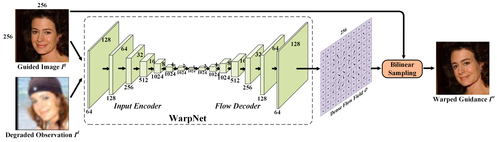
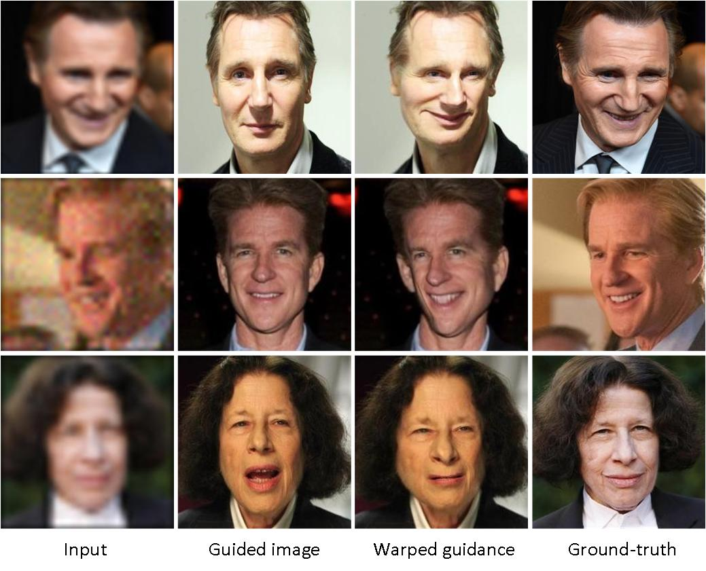

 Pytorch implementation of <B>WarpNet</B> for [Learning Warped Guidance for Blind Face Restoration](https://arxiv.org/abs/1804.04829)
 
 # WarpNet framework
This is only the subnet of GFRNet. The <B>WarpNet</B> takes the degraded observation and guided image as input to predict the dense flow field, which is adopted to deform guided image to the warped guidance. Network architecture is shown below.



# Data
Download the image and landmark data from the following url and put them into ./TrainData/.
- [BaiduNetDisk]()
- [GoogleDrive](https://drive.google.com/open?id=1Tjw8DLAzjO7XS9DldvNqiY3OhGekRhIj)

# Training

```bash
python train.py
tensorboard --logdir GFRNet_FlowNet --port 8008
```

# Warped Results



# Citation

```
@InProceedings{Li_2018_ECCV,
author = {Li, Xiaoming and Liu, Ming and Ye, Yuting and Zuo, Wangmeng and Lin, Liang and Yang, Ruigang},
title = {Learning Warped Guidance for Blind Face Restoration},
booktitle = {The European Conference on Computer Vision (ECCV)},
month = {September},
year = {2018}
}
```
